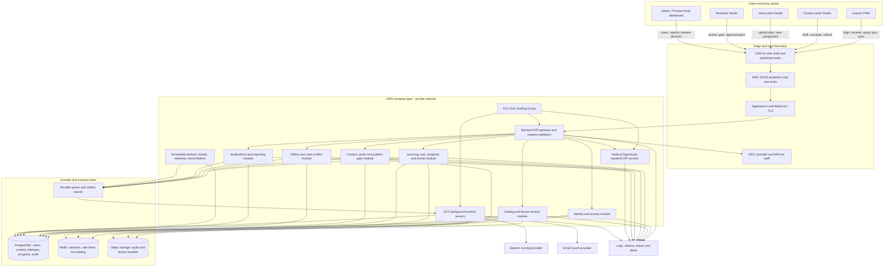

# LangLeap Production Architecture and Deployment

## 1. Target architecture

Use a modular monolith for the first production release: one TypeScript backend API deployed across an EC2 Auto Scaling Group, with independently testable modules for auth, lessons, progression, studio, notifications and reporting. Run background workers on separate EC2 instances so asynchronous processing cannot exhaust API capacity.

## 2. Complete user flows through the system

The system design above is organized around the following complete workflows. Every flow crosses the same authenticated edge and backend API boundary, but each role receives only the module and data permissions needed for its work.

### 2.1 Learner flow

1. The learner registers or signs in through the OIDC/password flow; the API creates a session, device record and language/level profile.
2. The dashboard requests published catalog data. The catalog module calculates `available`, `locked`, `in_progress` and `completed` states from published versions and progress.
3. The learner opens a lesson. The API returns only the published version, bilingual lines, audio metadata and quiz prompts; correct answers remain server-side.
4. Speaking practice uploads a signed recording to object storage. A worker calls the speech provider and writes a score or explicit unavailable state without blocking the quiz.
5. Quiz submission sends an idempotency key. The learning module calculates the score, stores answers and attempt data, then transactionally updates progress, unlock state, streak and outbox events.
6. If offline, the PWA reads cached published content and queues the attempt locally. The sync module replays it after reconnect with exactly-once effect and conflict-safe best-score projection.
7. Notification workers create result/unlock reminders, and the learner sees the authoritative progress after refresh.

### 2.2 Content writer flow

1. The writer signs in with staff MFA and receives writer-scoped permissions.
2. The studio creates a new immutable lesson version containing English text, Hindi glosses, Marathi glosses, hints, objectives and quiz questions.
3. Draft validation checks required fields, minimum script lines, quiz count and version ownership. The writer submits the version for review.
4. The reviewer receives an event-driven task. A rejected version returns to draft with notes; an accepted version becomes eligible for audio and publish checks.

### 2.3 Voice artist flow

1. The artist sees assigned approved script versions and line-level target durations.
2. The artist records or uploads a take through a signed object-storage URL. The API stores checksum, MIME type, duration, take number and artist identity.
3. A worker normalizes and scans the audio, calculates duration/loudness metadata and marks the take submitted, accepted or rejected.
4. Re-recording always creates a new immutable take. Only an accepted take inside the 0.90-1.10 duration ratio can satisfy the publish gate.

### 2.4 Reviewer, admin and product-head flow

1. The reviewer opens a version comparison showing script, translations, quiz, audio metadata and automated gate results.
2. The reviewer approves or rejects with a checklist and notes. The decision is written to the audit log and emits a workflow event.
3. Admins manage users, roles, assignments, feature flags and operational exceptions. They cannot bypass immutable history; overrides require a reason and audit event.
4. The product head reviews throughput, accepted audio, quality defects, learner completion, release readiness and schedule buffer, then approves the launch decision.

### 2.5 Runtime controls for all flows

Each backend server exposes `/health/live` and `/health/ready`; readiness checks database and queue reachability without leaking credentials. EC2 instances run in private subnets across availability zones behind the load balancer, use IAM instance roles, encrypted EBS volumes, security groups, immutable AMIs or container images, rolling Auto Scaling refreshes, and a migration job before rollout. Security groups allow only ALB-to-API, API-to-data, worker-to-queue/object-storage and telemetry egress paths.

## 3. Logical modules

- **Identity and access:** registration/invite, login, password reset, session rotation, MFA for staff, role and permission checks.
- **Lesson catalog:** immutable lesson versions, publication state, bilingual content, quiz items, audio references.
- **Content Studio:** writer drafts, reviewer decisions, version comparisons, audio assignments and publish gate.
- **Learning engine:** lesson launch authorization, quiz scoring, attempts, progression and streak transaction.
- **Offline sync:** device registration, idempotency keys, queued result replay, conflict policy.
- **Speech adapter:** signed upload, asynchronous transcription/pronunciation scoring, provider failure isolation.
- **Notifications:** event consumers, in-app inbox, optional email/push adapters.
- **Audit and reporting:** append-only decisions and operational metrics; no mutable audit history.

## 4. Data model

Core tables are described in PostgreSQL terms. UUIDs are used for external identifiers; timestamps are UTC `timestamptz`.

| Table | Important fields and constraints |
|---|---|
| `users` | `id`, email unique, password hash or external subject, name, first language, level, status, created/updated |
| `roles` / `user_roles` | Role catalogue and many-to-many assignments; never trust a client-supplied role |
| `sessions` | Refresh-token hash, user, expiry, revoked-at, device metadata |
| `courses` | Language pair, level, title, status and ordering metadata |
| `lessons` | Stable lesson id, code unique, course, position, lifecycle state, current published version |
| `lesson_versions` | Version, title, bilingual hint, author, source status, created-at; unique `(lesson_id, version)` |
| `script_lines` | Version, ordinal, English, Hindi, Marathi; unique `(version_id, ordinal)` |
| `quiz_questions` / `quiz_options` | Version, ordinal, prompt, options, correct option kept server-side; never expose answer before submission |
| `audio_assets` | Version, artist, object key, checksum, duration, target duration, status, QA decision, immutable take number |
| `content_reviews` | Version, reviewer, decision, notes, gate snapshot, decided-at |
| `lesson_progress` | User, lesson version, best score, passed, attempts, latest completion; unique `(user_id, lesson_id)` |
| `quiz_attempts` | User, lesson version, idempotency key unique, answers hash, score, pass flag, completed-at |
| `speaking_attempts` | User, line, object key, provider status, score, created-at |
| `streaks` | User, current/best, last qualifying day, freeze week, freezes used; one row per user |
| `notifications` | User, event key unique per intended event, title, body, read-at, created-at |
| `devices` / `sync_operations` | User/device, client operation id unique, payload hash, applied-at, result/error |
| `audit_events` | Actor, action, entity, before/after JSON, request id, timestamp; append-only |

Recommended indexes: `lessons(course_id, position, state)`, `lesson_progress(user_id, passed)`, `quiz_attempts(user_id, completed_at desc)`, `notifications(user_id, read_at, created_at desc)`, `sync_operations(user_id, client_operation_id)`, and `audit_events(entity_type, entity_id, occurred_at desc)`.

## 5. API contract

| Method | Endpoint | Authorization | Behavior |
|---|---|---|---|
| POST | `/v1/auth/login` | Public | Establish session and return user summary |
| POST | `/v1/auth/refresh` | Refresh token | Rotate session |
| GET | `/v1/me` | Authenticated | Current user and permissions |
| GET | `/v1/lessons` | Learner | Published catalog with computed launch state |
| GET | `/v1/lessons/:id` | Learner | Published lesson without correct answers |
| POST | `/v1/lessons/:id/attempts` | Learner | Score quiz atomically; requires `Idempotency-Key` |
| POST | `/v1/speaking-attempts` | Learner | Signed upload and async scoring |
| GET | `/v1/progress` | Learner | Progress and streak projection |
| POST | `/v1/sync/operations` | Learner | Replay offline operations idempotently |
| GET/POST/PATCH | `/v1/studio/lessons` | Writer/admin/head | Draft authoring and submission |
| POST | `/v1/studio/audio/:version/submit` | Artist | Submit audio take |
| POST | `/v1/studio/reviews/:version/decision` | Reviewer/admin/head | Gate, accept/reject, publish |
| GET/PATCH | `/v1/notifications` | Authenticated | Inbox and read state |

All mutating endpoints validate Zod-like schemas, enforce ownership/role policy, return a request id, and use typed error codes. The server calculates score, unlock, streak and gate decisions; the browser only displays them.

## 6. Critical transaction: quiz completion

1. Validate session, published version and idempotency key.
2. Load question answers and calculate score on the server.
3. Insert `quiz_attempts` with a unique idempotency key.
4. In one transaction, update `lesson_progress`, determine whether the lesson passed, update streak using the tenant timezone, and create unlock/result notification events.
5. Commit and publish an outbox event. If the client retries, return the original result.

## 7. Offline and conflict policy

Cache only published lesson content and audio metadata, never answer keys or staff data. Each offline result contains user, lesson version, attempt id, client operation id, recorded time and answers. Server replay is at-least-once transport with exactly-once effect via unique operation/idempotency keys. A later server result wins for the same lesson's displayed best score; attempts remain append-only. Expired lesson versions are rejected with a refresh-required response.

## 8. Security and privacy

Use Argon2id or managed identity, secure/httpOnly same-site cookies, CSRF protection where cookie auth is used, rate limits on login and attempts, object-storage signed URLs, MIME/size/duration validation, malware scanning, strict CORS, CSP, input validation, parameterized SQL, least-privilege service accounts, encrypted backups, and staff MFA. Do not log passwords, tokens, quiz answers, raw recordings or unnecessary PII. Provide account deletion/export workflows and retention policies.

## 9. Deployment and DevOps

- **Environments:** local, pull-request preview, staging, production; separate databases, buckets, secrets and auth tenants.
- **CI gates:** install with lockfile, lint, typecheck, unit/integration tests, coverage threshold, build, dependency scan, SAST, container scan, migration validation, and Playwright smoke tests.
- **CD:** build immutable frontend assets and API image, run migrations as a controlled job, deploy API with rolling health checks, publish frontend to CDN, then run smoke tests. Roll back application image and feature flags; use backward-compatible expand/contract migrations.
- **Infrastructure:** CDN/WAF, Application Load Balancer, EC2 Auto Scaling Groups across at least two availability zones, managed PostgreSQL with point-in-time recovery, Redis, object storage with lifecycle rules, queue, secret manager, centralized logs, metrics and traces.
- **EC2 controls:** private subnets, IAM instance profiles, security groups, encrypted EBS, launch templates, target tracking on CPU/request count/queue depth, rolling instance refresh, AMI or image signing, and separate API/worker groups.
- **Observability:** request latency/error rate, quiz idempotency conflicts, sync backlog, publish-gate failures, audio processing age, login failures, queue depth, database saturation, uptime and business metrics such as lesson completion.
- **Backups:** daily encrypted snapshots plus point-in-time recovery; quarterly restore drill. Target RPO <=15 minutes and RTO <=60 minutes.
- **Release safety:** feature flags for speech scoring and notifications, staged migrations, canary or 10% rollout for API changes, alert ownership and runbooks.

## 10. Frontend migration from the current demo

Replace local storage functions in `data/learner.ts`, `data/sync.ts` and `data/lessons.ts` with a typed API client while keeping their domain-level names during migration. Keep route guards, role names, statuses and threshold values stable. Add loading, empty, error, expired-session, offline and conflict states. The demo's simulated microphone and audio URLs become signed uploads and provider-backed status polling.
