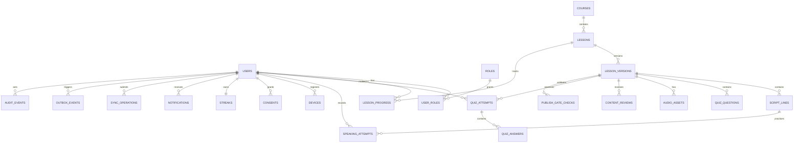

# LangLeap Production Database Schema

This is the relational source of truth for the production design. PostgreSQL is recommended because LangLeap needs transactions for quiz completion, strong uniqueness for offline replay, immutable version history, and reliable reporting. The SQL is a logical schema reference; migration files should add it incrementally with expand/contract changes.

## 1. Entity relationship model



## 2. PostgreSQL DDL reference

```sql
create type first_language as enum ('hindi', 'marathi');
create type english_level as enum ('A1', 'A2');
create type account_status as enum ('active', 'invited', 'suspended', 'deleted');
create type lesson_state as enum ('draft', 'in_review', 'published', 'deprecated');
create type audio_status as enum ('draft', 'submitted', 'accepted', 'rejected');
create type review_decision as enum ('accepted', 'rejected');
create type sync_status as enum ('pending', 'applied', 'rejected');
create type processing_status as enum ('queued', 'processing', 'completed', 'failed');
create type gate_status as enum ('passed', 'failed', 'waived');

create table users (
  id uuid primary key default gen_random_uuid(),
  email text not null unique,
  password_hash text,
  external_subject text unique,
  full_name text not null,
  first_language first_language not null,
  level english_level not null default 'A1',
  status account_status not null default 'invited',
  created_at timestamptz not null default now(),
  updated_at timestamptz not null default now(),
  check (password_hash is not null or external_subject is not null)
);

create table roles (
  id text primary key,
  description text not null
);

create table user_roles (
  user_id uuid not null references users(id) on delete cascade,
  role_id text not null references roles(id),
  assigned_by uuid references users(id),
  assigned_at timestamptz not null default now(),
  primary key (user_id, role_id)
);

create table sessions (
  id uuid primary key default gen_random_uuid(),
  user_id uuid not null references users(id) on delete cascade,
  refresh_token_hash text not null unique,
  expires_at timestamptz not null,
  revoked_at timestamptz,
  device_id text,
  created_at timestamptz not null default now()
);

create table courses (
  id uuid primary key default gen_random_uuid(),
  code text not null unique,
  title text not null,
  language_pair text not null default 'en-hi-mr',
  level english_level not null,
  status text not null default 'active',
  created_at timestamptz not null default now()
);

create table lessons (
  id uuid primary key default gen_random_uuid(),
  course_id uuid not null references courses(id),
  code text not null unique,
  position integer not null check (position > 0),
  state lesson_state not null default 'draft',
  published_version_id uuid,
  created_at timestamptz not null default now(),
  updated_at timestamptz not null default now(),
  unique (course_id, position)
);

create table lesson_versions (
  id uuid primary key default gen_random_uuid(),
  lesson_id uuid not null references lessons(id) on delete cascade,
  version integer not null check (version > 0),
  title text not null,
  hint_en text not null,
  hint_hi text not null,
  hint_mr text not null,
  created_by uuid not null references users(id),
  created_at timestamptz not null default now(),
  unique (lesson_id, version)
);

alter table lessons
  add constraint lessons_published_version_fk
  foreign key (published_version_id) references lesson_versions(id);

create table script_lines (
  id uuid primary key default gen_random_uuid(),
  version_id uuid not null references lesson_versions(id) on delete cascade,
  ordinal integer not null check (ordinal > 0),
  text_en text not null,
  text_hi text not null,
  text_mr text not null,
  unique (version_id, ordinal)
);

create table quiz_questions (
  id uuid primary key default gen_random_uuid(),
  version_id uuid not null references lesson_versions(id) on delete cascade,
  ordinal integer not null check (ordinal > 0),
  prompt text not null,
  options jsonb not null,
  correct_index integer not null,
  check (jsonb_typeof(options) = 'array'),
  unique (version_id, ordinal)
);

create table audio_assets (
  id uuid primary key default gen_random_uuid(),
  version_id uuid not null references lesson_versions(id) on delete cascade,
  artist_id uuid not null references users(id),
  take_number integer not null check (take_number > 0),
  object_key text not null unique,
  checksum text not null,
  duration_sec integer not null check (duration_sec > 0),
  target_duration_sec integer not null check (target_duration_sec >= 10),
  status audio_status not null default 'draft',
  note text,
  created_at timestamptz not null default now(),
  unique (version_id, take_number)
);

create table content_reviews (
  id uuid primary key default gen_random_uuid(),
  version_id uuid not null references lesson_versions(id) on delete cascade,
  reviewer_id uuid not null references users(id),
  decision review_decision not null,
  gate_snapshot jsonb not null,
  note text,
  decided_at timestamptz not null default now()
);

create table lesson_progress (
  user_id uuid not null references users(id) on delete cascade,
  lesson_id uuid not null references lessons(id),
  best_score numeric(5,2) not null default 0 check (best_score between 0 and 100),
  passed boolean not null default false,
  attempts integer not null default 0 check (attempts >= 0),
  latest_completed_at timestamptz,
  updated_at timestamptz not null default now(),
  primary key (user_id, lesson_id)
);

create table quiz_attempts (
  id uuid primary key default gen_random_uuid(),
  user_id uuid not null references users(id) on delete cascade,
  lesson_version_id uuid not null references lesson_versions(id),
  idempotency_key text not null,
  answers jsonb not null,
  score numeric(5,2) not null check (score between 0 and 100),
  passed boolean not null,
  completed_at timestamptz not null default now(),
  unique (user_id, idempotency_key)
);

create table streaks (
  user_id uuid primary key references users(id) on delete cascade,
  current_days integer not null default 0 check (current_days >= 0),
  best_days integer not null default 0 check (best_days >= current_days),
  last_day date,
  freeze_week date,
  freezes_used integer not null default 0 check (freezes_used between 0 and 1)
);

create table notifications (
  id uuid primary key default gen_random_uuid(),
  user_id uuid not null references users(id) on delete cascade,
  event_key text not null,
  title text not null,
  message text not null,
  read_at timestamptz,
  created_at timestamptz not null default now(),
  unique (user_id, event_key)
);

create table sync_operations (
  id uuid primary key default gen_random_uuid(),
  user_id uuid not null references users(id) on delete cascade,
  device_id text not null,
  client_operation_id text not null,
  operation_type text not null,
  payload jsonb not null,
  status sync_status not null default 'pending',
  error_code text,
  applied_at timestamptz,
  created_at timestamptz not null default now(),
  unique (user_id, client_operation_id)
);

create table audit_events (
  id bigserial primary key,
  actor_id uuid references users(id),
  action text not null,
  entity_type text not null,
  entity_id uuid,
  before_data jsonb,
  after_data jsonb,
  request_id text,
  occurred_at timestamptz not null default now()
);

-- Production extensions: identity, consent, normalized answers, speaking,
-- asynchronous delivery and operational replay metadata.
alter table users
  add column timezone text not null default 'Asia/Kolkata',
  add column locale text not null default 'en-IN',
  add column avatar_object_key text,
  add column last_login_at timestamptz,
  add column email_verified_at timestamptz,
  add column deleted_at timestamptz;

alter table roles
  add column created_at timestamptz not null default now();

alter table sessions
  add column token_family uuid not null default gen_random_uuid(),
  add column ip_hash text,
  add column user_agent text,
  add column last_used_at timestamptz;

alter table courses
  add column description text,
  add column cover_object_key text,
  add column sort_order integer not null default 0,
  add column published_at timestamptz;

alter table lessons
  add column estimated_minutes integer not null default 10,
  add column objective text,
  add column tags text[] not null default '{}',
  add column deleted_at timestamptz,
  add constraint lessons_estimated_minutes_check check (estimated_minutes between 1 and 120);

alter table lesson_versions
  add column content_hash text not null default 'pending-migration-hash',
  add column target_audio_duration_sec integer,
  add column change_summary text,
  add column published_at timestamptz,
  add column deprecated_at timestamptz;

alter table audio_assets
  add column mime_type text not null default 'audio/mpeg',
  add column sample_rate_hz integer,
  add column loudness_lufs numeric(6,2),
  add column waveform_object_key text,
  add column uploaded_at timestamptz,
  add column accepted_at timestamptz;

alter table content_reviews
  add column review_round integer not null default 1,
  add column checklist jsonb not null default '{}'::jsonb;

alter table lesson_progress
  add column started_at timestamptz,
  add column completed_count integer not null default 0,
  add column last_attempt_id uuid;

alter table quiz_attempts
  add column attempt_number integer not null default 1,
  add column device_id uuid,
  add column started_at timestamptz,
  add column answers_hash text not null default 'pending-migration-hash',
  add column submitted_offline boolean not null default false,
  add column server_received_at timestamptz not null default now();

create table consents (
  id uuid primary key default gen_random_uuid(),
  user_id uuid not null references users(id) on delete cascade,
  consent_type text not null,
  policy_version text not null,
  granted boolean not null,
  granted_at timestamptz not null default now(),
  withdrawn_at timestamptz,
  unique (user_id, consent_type, policy_version)
);

create table devices (
  id uuid primary key default gen_random_uuid(),
  user_id uuid not null references users(id) on delete cascade,
  device_key text not null,
  platform text not null,
  app_version text,
  push_token text,
  last_seen_at timestamptz,
  created_at timestamptz not null default now(),
  unique (user_id, device_key)
);

create table quiz_answers (
  attempt_id uuid not null references quiz_attempts(id) on delete cascade,
  question_id uuid not null references quiz_questions(id),
  selected_option_id uuid,
  answer_text text,
  is_correct boolean not null,
  awarded_points integer not null default 0 check (awarded_points >= 0),
  primary key (attempt_id, question_id),
  check (selected_option_id is not null or answer_text is not null)
);

create table quiz_options (
  id uuid primary key default gen_random_uuid(),
  question_id uuid not null references quiz_questions(id) on delete cascade,
  ordinal integer not null check (ordinal > 0),
  option_text text not null,
  is_correct boolean not null default false,
  unique (question_id, ordinal)
);

create table speaking_attempts (
  id uuid primary key default gen_random_uuid(),
  user_id uuid not null references users(id) on delete cascade,
  script_line_id uuid not null references script_lines(id),
  device_id uuid references devices(id),
  object_key text not null unique,
  provider text,
  status processing_status not null default 'queued',
  transcript text,
  pronunciation_score numeric(5,2) check (pronunciation_score between 0 and 100),
  provider_request_id text,
  error_code text,
  created_at timestamptz not null default now(),
  completed_at timestamptz
);

create table publish_gate_checks (
  id uuid primary key default gen_random_uuid(),
  version_id uuid not null references lesson_versions(id) on delete cascade,
  check_name text not null,
  status gate_status not null,
  measured_value text,
  expected_value text,
  checked_by uuid references users(id),
  checked_at timestamptz not null default now(),
  unique (version_id, check_name)
);

create table streak_events (
  id uuid primary key default gen_random_uuid(),
  user_id uuid not null references users(id) on delete cascade,
  activity_day date not null,
  event_type text not null,
  lesson_id uuid references lessons(id),
  streak_value integer not null check (streak_value >= 0),
  created_at timestamptz not null default now(),
  unique (user_id, activity_day, event_type)
);

create table outbox_events (
  id uuid primary key default gen_random_uuid(),
  aggregate_type text not null,
  aggregate_id uuid not null,
  event_type text not null,
  payload jsonb not null,
  occurred_at timestamptz not null default now(),
  published_at timestamptz,
  attempts integer not null default 0 check (attempts >= 0),
  last_error text
);

alter table quiz_answers
  add constraint quiz_answers_option_fk
  foreign key (selected_option_id) references quiz_options(id);

alter table lesson_progress
  add constraint lesson_progress_attempt_fk
  foreign key (last_attempt_id) references quiz_attempts(id);

create index lesson_versions_published_idx on lesson_versions(lesson_id, published_at desc);
create index speaking_user_time_idx on speaking_attempts(user_id, created_at desc);
create index gate_checks_version_idx on publish_gate_checks(version_id, status);
create index outbox_pending_idx on outbox_events(occurred_at) where published_at is null;
```

## 3. Indexes and integrity policies

```sql
create index lessons_catalog_idx on lessons(course_id, state, position);
create index progress_user_idx on lesson_progress(user_id, passed);
create index attempts_user_time_idx on quiz_attempts(user_id, completed_at desc);
create index notifications_user_time_idx on notifications(user_id, read_at, created_at desc);
create index sync_pending_idx on sync_operations(user_id, status, created_at);
create index audit_entity_idx on audit_events(entity_type, entity_id, occurred_at desc);
```

Application-level publish transaction must verify every line has all three languages, there are at least three quiz questions, an accepted audio asset exists, and `duration_sec / target_duration_sec` is between 0.90 and 1.10. The database stores the gate snapshot and review decision for auditability; policy code is responsible for the cross-table validation.

Use row-level security or service-layer authorization so learners can read only published versions and their own progress, writers can modify their own drafts, staff can access assigned studio actions, and only reviewer/admin/product-head roles can publish. Correct quiz answers are never serialized to learner API responses.

## 4. Migration and retention rules

Use numbered migrations, transactional DDL where supported, expand/contract for renamed columns, and a migration rehearsal on a production-sized staging copy. Keep published lesson versions immutable. Retain quiz attempts, progress, reviews and audit events for at least the SRS audit period; delete or anonymize account-linked PII according to the approved privacy policy. Object storage should retain accepted audio and remove abandoned takes using a lifecycle rule after the retention review.
