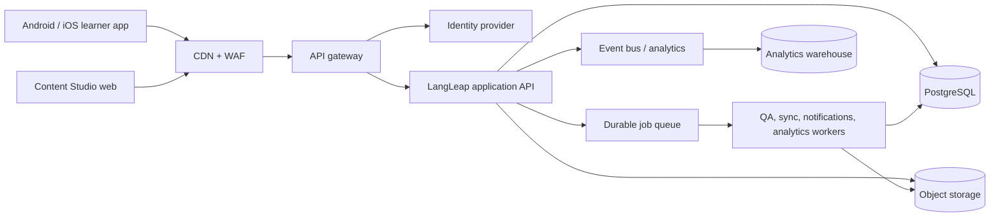

# LangLeap Production Architecture

## 1. Purpose and Boundary

This document turns the frontend mock into a production blueprint for the product in
`ProblemStatement`. It covers the learner app, Content Studio, APIs, offline behavior,
deployment, security, and operational ownership. The current `frontend/` remains a
deliberately backend-free demonstration; localStorage and simulated recording are not
production persistence.

## 2. Target System

### Runtime components

| Component | Production responsibility | Suggested implementation |
| --- | --- | --- |
| Learner client | Cached lesson packages, speaking capture, quiz and sync UX | React Native or native Android/iOS clients; web mock is a prototype |
| Studio client | Author, record metadata, review and publish | React web app using the existing route and role model |
| API | Authenticated domain commands and read models | TypeScript service with REST/OpenAPI; stateless containers |
| Database | Users, immutable lesson versions, progress, streaks, audit records | PostgreSQL with migrations and row-level authorization |
| Object storage | Version-pinned audio and temporary speaking attempts | S3-compatible storage with private buckets and signed URLs |
| Workers | QA gates, audio inspection, notification delivery, sync reconciliation | Queue consumers with retries and dead-letter queues |
| CDN | Static assets and published lesson package caching | CDN with immutable content hashes |

## 3. Domain Boundaries

The normalized PostgreSQL model and ER diagram are maintained in
[LL-Database-Schema.md](LL-Database-Schema.md). It is the source of truth for lesson-version,
audio-review, content-review, learner-progress, sync, and audit persistence.

1. **Identity and access:** users, roles, language, level, session and MFA for studio roles.
2. **Catalog:** immutable lesson versions, bilingual script, vocabulary, quiz items and publish state.
3. **Media:** audio metadata, duration validation, checksum and storage lifecycle.
4. **Learning:** daily assignment, attempts, score, completion, unlock and streak rules.
5. **Sync:** idempotent client commands, conflict policy and retry state.
6. **Notifications and analytics:** best-effort reminders and privacy-safe product events.

The audio workflow is explicit: `record -> submit for audio QA -> accept/reject`. A rejected
take remains available for audit and must be re-recorded before it can be submitted again.
Content review follows separately: `draft -> in_review -> accepted/published` or `rejected -> draft`.

The catalog publishes a signed, versioned lesson package. The learner client consumes that
package and never reads draft or in-review content. Publishing a new version creates a new
package; an existing learner attempt retains its lesson-version reference.

## 4. API Contract

The API is contract-first and published as OpenAPI. Representative commands are:

| Method | Endpoint | Purpose | Idempotency |
| --- | --- | --- | --- |
| `POST` | `/v1/auth/signup` | Create learner with language and level | Email uniqueness |
| `GET` | `/v1/catalog?level=A1&locale=hi` | Fetch published package manifest | ETag / version |
| `POST` | `/v1/attempts` | Record quiz result and completion | `Idempotency-Key` |
| `POST` | `/v1/sync/batch` | Flush offline commands | Per-command key |
| `POST` | `/v1/studio/lessons/{id}/submit` | Move draft to review | State transition guard |
| `POST` | `/v1/studio/audio/{id}/submit` | Submit a recorded take for QA | State transition guard |
| `POST` | `/v1/studio/audio/{id}/accept` | Accept a duration-validated take | Audit event |
| `POST` | `/v1/studio/audio/{id}/reject` | Reject a take with a reason | Audit event |
| `POST` | `/v1/studio/lessons/{id}/publish` | Run gates and publish version | Audit event |

The unlock decision is server-authoritative. The client may show a predicted result, but the
API recalculates `previousPassed && score >= threshold && nextPublished` inside a transaction.
Duplicate commands return the original result. Out-of-order or stale lesson versions are
rejected with a recoverable conflict response.

## 5. Offline and Sync Design

- Cache the current lesson package, audio manifest and quiz in an encrypted local database.
- Store quiz results and speaking-attempt metadata as an append-only outbox item with a UUID,
  user ID, lesson version, client timestamp and schema version.
- Retry with exponential backoff when connectivity returns; retain failed items after the
  retry limit and show a retry action.
- The server validates ownership, lesson version, score range `0..100`, and idempotency key.
- Quiz results are immutable facts. A later retry cannot lower a previously recorded best score;
  the server keeps all attempts and derives the learner's current progression.
- Speaking audio is encrypted locally, uploaded only after consent, and expires according to
  the NFR-06 retention target.

## 6. Security and Privacy

- OIDC authorization-code flow with PKCE for clients; short-lived access tokens and rotating refresh tokens.
- Server-side role checks for every Studio command; hidden navigation is only a usability feature.
- TLS in transit, encrypted database and object storage at rest, signed media URLs, and no audio in logs.
- Passwords are never stored by the app; production identity is delegated to the identity provider.
- Validate all content and quiz input server-side; sanitize rendered text and scan uploads.
- Audit author, reviewer, version, gate result, publish and deprecate events.
- Provide consent, export, deletion, retention and regional data controls appropriate for Indian users.

## 7. Reliability and Observability

Initial service targets should map directly to the measurable NFRs in the SRS:

- catalog read availability: 99.9% monthly;
- p95 catalog API latency: 500 ms online;
- sync success within five minutes of reconnect: 99%;
- publish gate decisions: 99.9% durable and auditable;
- alert on API 5xx, queue age, sync conflict rate, audio processing failures and auth anomalies.

Emit structured logs with `request_id`, `user_id` hash, `lesson_version` and `idempotency_key`.
Use metrics, traces and dashboards with redacted payloads. Define an on-call owner and link
every alert to a runbook before launch.

## 8. Data Lifecycle and Recovery

Use daily encrypted backups, point-in-time recovery for PostgreSQL, object versioning for audio,
and a tested restore procedure. Suggested launch objectives are RPO <= 15 minutes for learning
events and RTO <= 60 minutes for the API. Run restore drills quarterly. Never use production
learner data in development; seed synthetic Hindi and Marathi fixtures instead.

## 9. Migration from This Mock

1. Replace localStorage auth with OIDC and `/v1/auth`.
2. Move lesson seed data into PostgreSQL migrations or an import job; preserve lesson version IDs.
3. Replace mock audio URLs with signed object-storage URLs and an asynchronous duration worker.
4. Replace `src/data/sync.ts` with the API outbox adapter while retaining the same idempotency contract.
5. Add contract, integration, accessibility, device, security and load tests to the CI gates.
