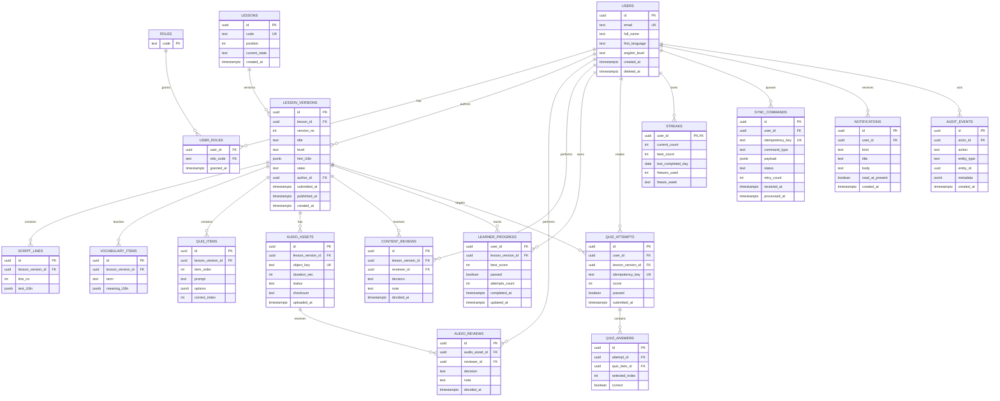

# LangLeap Production Database Schema

This schema is the production persistence model for the learner app and Content Studio.
The current frontend mock uses localStorage, so this document is a target design rather
than a claim that these tables already exist in the mock.

## Design Rules

- PostgreSQL is the system of record; IDs are UUIDs and timestamps are UTC.
- Published lesson content is immutable. Editing creates a new `lesson_versions` row.
- Audio is pinned to a lesson version. Changing the script invalidates the old audio take.
- Quiz attempts and sync commands are append-only and idempotent.
- `content_reviews` and `audio_reviews` preserve accepted/rejected history instead of overwriting it.
- All Studio mutations create an `audit_events` row.

## Entity Relationship Diagram



## Key Constraints and Indexes

```sql
CREATE UNIQUE INDEX uq_lesson_version
  ON lesson_versions (lesson_id, version_no);

CREATE UNIQUE INDEX uq_published_version_per_lesson
  ON lesson_versions (lesson_id)
  WHERE state = 'published';

CREATE UNIQUE INDEX uq_attempt_idempotency
  ON quiz_attempts (idempotency_key);

CREATE UNIQUE INDEX uq_sync_command_idempotency
  ON sync_commands (idempotency_key);

CREATE INDEX ix_catalog_lookup
  ON lesson_versions (state, level, lesson_id, version_no);

CREATE INDEX ix_progress_by_learner
  ON learner_progress (user_id, updated_at DESC);

CREATE INDEX ix_audio_queue
  ON audio_assets (status, uploaded_at);
```

## State Transitions

### Lesson content

`draft -> in_review -> published -> deprecated`

Rejection returns the version to `draft` and adds a `content_reviews(decision = 'rejected')`
row. A published version is never edited in place.

### Audio

`draft -> submitted -> accepted`

`submitted -> rejected -> draft`

Audio acceptance requires a stored duration between 90% and 110% of the script target,
and the reviewer decision remains auditable in `audio_reviews`. A lesson cannot publish
until it has an accepted audio asset for the exact lesson version.

## Transaction Boundaries

1. **Submit quiz:** insert `quiz_attempts`, insert answers, upsert derived `learner_progress`,
   evaluate unlock and streak, and enqueue an event in one transaction.
2. **Accept audio:** insert `audio_reviews`, update `audio_assets.status`, and write an audit
   event in one transaction.
3. **Publish lesson:** lock the lesson version, re-run all QA gates, verify accepted audio,
   insert `content_reviews`, update state, and write an audit event in one transaction.
4. **Offline replay:** insert the idempotency key first; repeated commands return the original
   result without duplicating progress or streak effects.
