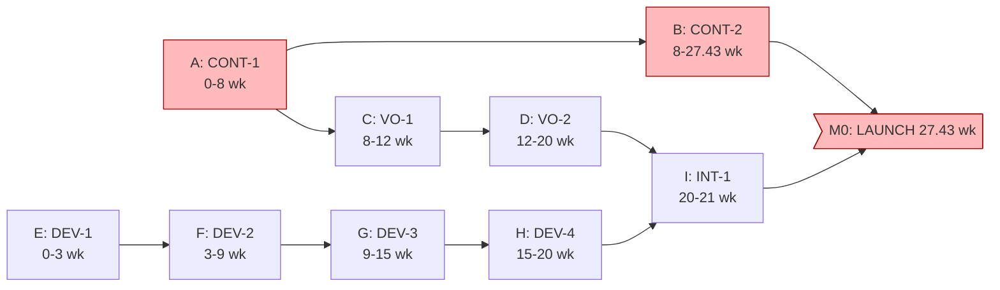

# Project Plan — LangLeap

## Project: **LangLeap** — English Language Learning App for Hindi & Marathi Speakers

| Field              | Value                                                       |
| ------------------ | ----------------------------------------------------------- |
| Document number    | LL-Project-Plan-1.0                                         |
| Prepared by        | Anoop (sole contributor — PM, engineering, QA)              |
| Date               | 01 Oct 2026                                                 |
| Status             | Approved                                                    |
| Related documents | LL-SRS-1.0 · LL-Estimation-Sheet-1.0 · LL-Risk-Register-1.0 |

---

## Revision History

| Version | Date | Author | Summary |
| ------- | ---- | ------ | ------- |
| 1.0     | 01 Oct 2026 | Anoop | Approved — WBS, network, critical path, Gantt, resources |

---

## Approvals

| Role | Name | Decision |
| ---- | ---- | -------- |
| Sole contributor, PM | Anoop | Approved |

---

## Table of Contents

1. Scheduling Basis (given figures)
2. Controlling Stream — Conclusion
3. Work Breakdown Structure (WBS)
4. Network Diagram & Dependencies
5. Forward/Backward Pass — Critical Path & Floats
6. Gantt Chart with Milestones
7. Resource Allocation
8. Stretch (Should) Scope & Buffer

---

## 1. Scheduling Basis (given figures — no invented numbers)

| Figure             | Source                      |
| ------------------ | --------------------------- |
| Content rate       | 35 lessons in 8 weeks       |
| Voice rate         | 1.5 h/lesson @ 15 h/week    |
| App development    | 20 weeks                    |
| Launch content     | 120 lessons                 |
| Budget            | ₹35 lakh · ≤ 6 months       |

Computed rates (full math in LL-Estimation-Sheet-1.0):

- **Content:** 4.375 lessons/wk → **27.43 wk** for 120 lessons.
- **Voice:** 10 lessons/wk → **12 wk** for 120 lessons.
- **App:** **20 wk**.
- **6-month budget ≈ 26.0 wk** (6 × 4.33 wk/month) → overrun risk **≈ +1.4 wk** → Risk R-01 (matches LL-Estimation-Sheet-1.0 §6 and LL-Risk-Register-1.0 R-01).

## 2. Controlling Stream — Conclusion

> **The CONTENT stream controls the launch.** It is the longest stream (27.43 wk) and every
> other stream (voice 12 wk, app 20 wk) completes well before content does. Sliding the canvas by
> hiring a second writer (→ 8.75 lessons/wk) would shorten the critical path and bring launch inside
> the 6-month budget — this is the single highest-leverage schedule decision (see Risk R-01).

## 3. Work Breakdown Structure (WBS)

```
1.0 LangLeap Release v1
  1.1 Content Stream  (CONT)
    1.1.1 CONT-1  Write & QA first 35 lessons ............... 8.00 wk
    1.1.2 CONT-2  Write & QA lessons 36–120 (85 lessons) .... 19.43 wk
  1.2 Voice Stream   (VO)
    1.2.1 VO-1  Record audio lessons 1–40 ................... 4.00 wk
    1.2.2 VO-2  Record audio lessons 41–120 ................. 8.00 wk
  1.3 App Stream     (DEV)
    1.3.1 DEV-1  Scaffold, auth, onboarding ................. 3.00 wk
    1.3.2 DEV-2  Core lesson, quiz, progression ............. 6.00 wk
    1.3.3 DEV-3  Speaking practice + offline sync ........... 6.00 wk
    1.3.4 DEV-4  QA, polish, store build .................... 5.00 wk
  1.4 Integration & Launch (INT)
    1.4.1 INT-1  Content+voice integration & E2E test ....... 1.00 wk
  1.5 Milestones (zero-duration checkpoints)
    M1 First 35 lesson scripts ready ........ at wk 8.00
    M2 App alpha (core loop works) ......... at wk 9.00
    M3 Voice set complete ................... at wk 20.00
    M4 Store build ready .................... at wk 20.00
    M0 LAUNCH ............................... at wk 27.43
```

## 4. Network Diagram & Dependencies



**Dependency logic:** voice needs scripts (`VO-1` after `CONT-1`); integration needs both the recorded
set and a build (`INT-1` after `VO-2` + `DEV-4`); the launch cannot occur before content finishes.

## 5. Forward/Backward Pass — Critical Path & Floats

### 5.1 Network math

| ID | Task | Dur (wk) | ES | EF | LS | LF | **Float** | Critical? |
| -- | ---- | -------- | -- | -- | -- | -- | --------- | --------- |
| A  | CONT-1 | 8.00  | 0.00 | 8.00 | 0.00 | 8.00 | 0.00 | ✔ |
| B  | CONT-2 | 19.43 | 8.00 | 27.43 | 8.00 | 27.43 | 0.00 | ✔ |
| C  | VO-1   | 4.00  | 8.00 | 12.00 | 15.43 | 19.43 | 7.43 | |
| D  | VO-2   | 8.00  | 12.00 | 20.00 | 19.43 | 27.43 | 7.43 | |
| E  | DEV-1  | 3.00  | 0.00 | 3.00 | 7.43 | 10.43 | 7.43 | |
| F  | DEV-2  | 6.00  | 3.00 | 9.00 | 10.43 | 16.43 | 7.43 | |
| G  | DEV-3  | 6.00  | 9.00 | 15.00 | 16.43 | 22.43 | 7.43 | |
| H  | DEV-4  | 5.00  | 15.00 | 20.00 | 22.43 | 27.43 | 7.43 | |
| I  | INT-1  | 1.00  | 20.00 | 21.00 | 26.43 | 27.43 | 6.43 | |

Forward pass: `ES = max(EF of predecessors)`; `EF = ES + d`.
Backward pass: `LF = min(LS of successors)` (LAUNCH at 27.43); `LS = LF − d`.
Float = `LS − ES` (equivalently `LF − EF`).

### 5.2 Critical path

```
A (CONT-1) → B (CONT-2) → M0 (LAUNCH)   —   duration = 8.00 + 19.43 = 27.43 wk
```

- Zero-float tasks: **A and B**.
- **Every non-critical task has float listed above** — the app stream (E–H) and voice stream (C–D)
  each carry ≈ 7.4 wk, integration ≈ 6.4 wk. This float is the schedule's embedded contingency.

## 6. Gantt Chart with Milestones

Milestones are rendered as **zero-duration checkpoints** (`milestone: off`).

```mermaid
gantt
  title LangLeap — v1 Schedule (Weeks, from content start)
  dateFormat  DD
  axisFormat  wk

  section Content (critical)
  A CONT-1 (8w)        :a1, day0, 8d
  B CONT-2 (19.43w)    :a2, after a1, 19.43d
  M1 Scripts 35 done   :milestone, m1, 7d, 0d
  M0 LAUNCH            :milestone, m0, after a2, 0d

  section Voice
  C VO-1 (4w)          :c1, after a1, 4d
  D VO-2 (8w)          :c2, after c1, 8d
  M3 Voice done        :milestone, m5, after c2, 0d

  section App
  E DEV-1 (3w)         :e1, day0, 3d
  F DEV-2 (6w)         :f1, after e1, 6d
  G DEV-3 (6w)         :g1, after f1, 6d
  H DEV-4 (5w)         :h1, after g1, 5d
  M2 App alpha         :milestone, m2, after f1, 0d
  M4 Build ready       :milestone, m4, after h1, 0d

  section Integration
  I INT-1 (1w)         :i1, after h1, after c2, 1d
```

*(Gantt scales 1 unit = 1 week; day numbers are week indices.)*

## 7. Resource Allocation

| Stream | Resource | Weeks | Notes |
| ------ | -------- | ----- | ----- |
| Content | Content writers (given rate 4.375 lessons/wk) | 27.43 (8 + 19.43) | Doc prepared by sole contributor; writer capacity is operational input per problem statement |
| Voice | 1 voice artist @ 15 h/wk | 12 (4 + 8) | 10 lessons/wk capacity |
| App | **Anoop (sole developer + QA)** | 20 + 1 integration | All app/delivery effort single-resource |
| Docs & Plans | Anoop | throughout | This package |

**Solo-contributor note:** all documents, design, code and QA are produced by the single project
author; the content-writer and voice-artist roles are inputs whose rates are given in the problem
statement, not extra personnel on the project team.

## 8. Stretch (Should) Scope & Buffer

- **In launch (Must):** FR-01/02/03/04/06/07/09/11 on the critical path above.
- **Should (FR-05/08/10):** speaking practice, streaks, notifications — pinned to the app stream's
  **7.4 wk float**; if float is consumed, they are trimmed to post-launch rather than moving the launch.

**Buffer policy:** the 7.4 wk float on voice/app is *contingency*, not plan; the content stream's
1.3 wk overrun vs the 6-month budget is a **named risk** (R-01) with a response in LL-Risk-Register-1.0.