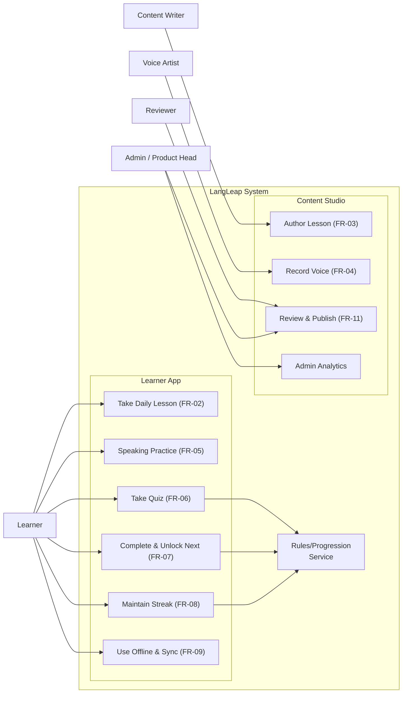
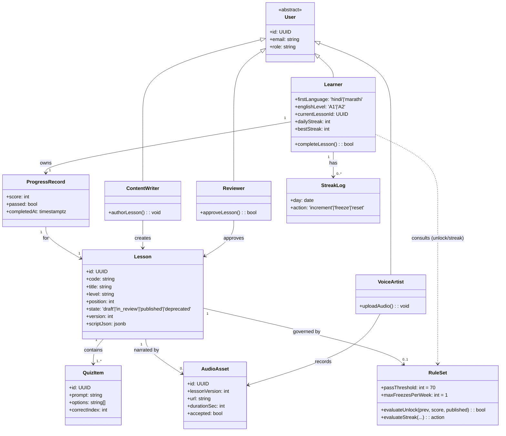
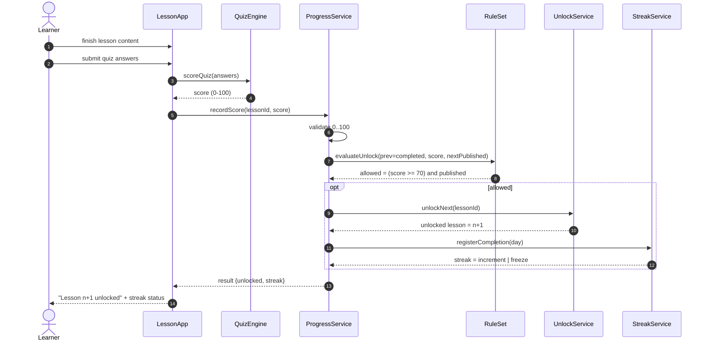
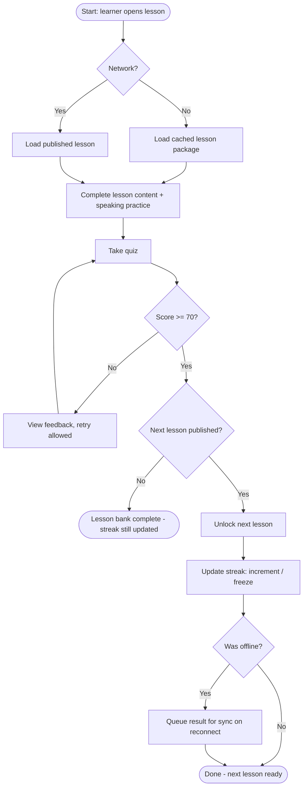
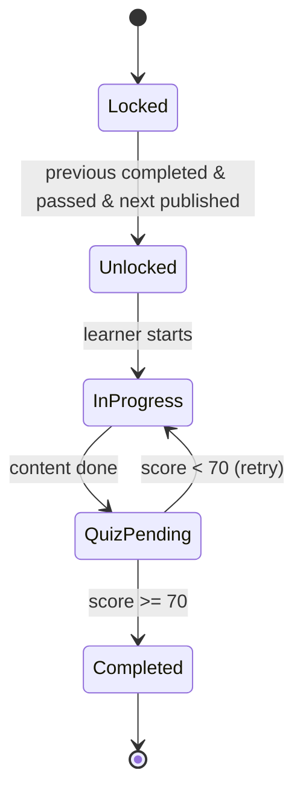
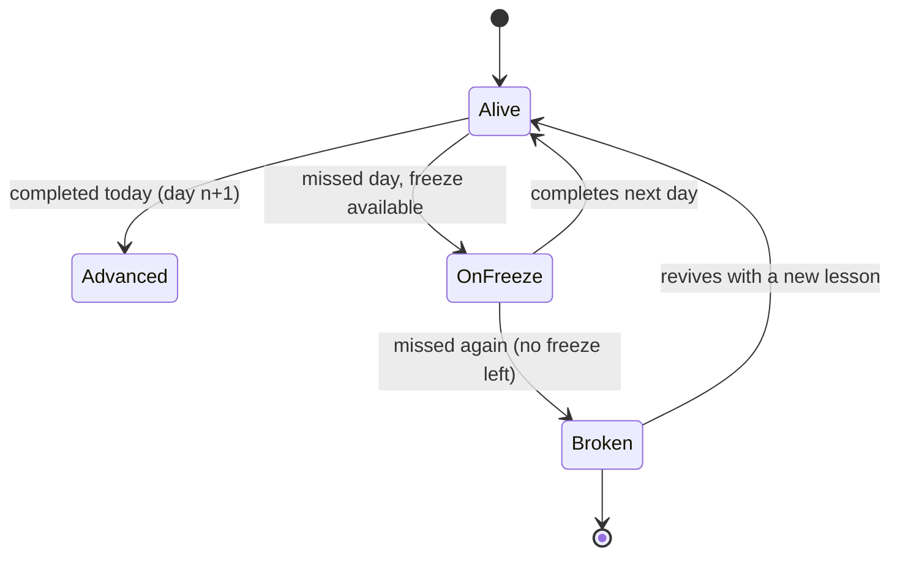

# UML Package — LangLeap

## Project: **LangLeap** — English Language Learning App for Hindi & Marathi Speakers

| Field              | Value                                                       |
| ------------------ | ----------------------------------------------------------- |
| Document number    | LL-UML-Package-1.0                                          |
| Prepared by        | Anoop (sole contributor — Design)                           |
| Date               | 01 Oct 2026                                                 |
| Status             | Approved                                                    |
| Related documents | LL-SRS-1.0 (FR-02…FR-11) · LL-Test-Plan-1.0 · LL-Project-Plan-1.0 |

---

## Revision History

| Version | Date | Author | Summary                          |
| ------- | ---- | ------ | ---------------------------------- |
| 1.0     | 01 Oct 2026 | Anoop | Approved — five diagrams + coupling justification |

---

## Approvals

| Role | Name | Decision |
| ---- | ---- | -------- |
| Sole contributor, Designer | Anoop | Approved |

---

## Table of Contents

1. Consistency Statement
2. Use Case Diagram
3. Class Diagram
4. Sequence Diagram — Complete a Lesson and Unlock the Next
5. Activity Diagram — Lesson Completion with Unlock Decision
6. State Diagram — Lesson Progress & Streak
7. Cohesion & Coupling Justification

---

## 1. Consistency Statement

All five diagrams model the **same** system and the **same** named elements:

- **Actors/classes:** `Learner`, `Content Writer`, `Voice Artist`, `Reviewer`, `Admin/Product Head`.
- **Boundaries/modules:** `Learner App` and `Content Studio`, plus a shared `Rules/Progression` service.
- **The lockstep case:** FR-06 (quiz pass `score ≥ 70`) → FR-07 (unlock next) → FR-08 (streak), offline flow FR-09.
- The names in the sequence, activity and state diagrams correspond 1:1 to classes in the class diagram and to the actors/use cases.

---

## 2. Use Case Diagram

**Actors (external):** Learner, Content Writer, Voice Artist, Reviewer, Admin/Product Head.
The `Rules/Progression` service is a **system actor** shared by Related use cases to keep unlock & streak uniform (single decision tables).

---

## 3. Class Diagram

**Key multiplicities:** one `Learner` has one `ProgressRecord` **per** lesson (ternary via `ProgressRecord(id, learner_id, lesson_id)`); one `Lesson` has many `QuizItem`s and may have an `AudioAsset` per **lesson version** (audio is version-pinned so a re-versioned script never attaches to stale audio).

---

## 4. Sequence Diagram — Complete a Lesson and Unlock the Next

Participant names map to the class diagram (`LessonApp`, `ProgressRecord`, `QuizEngine`, `RuleSet`, `UnlockService`).

FR-06 → FR-07 → FR-08 in one deterministic call chain; the `RuleSet` is the **single** place both unlock and streak decisions are made (used identically by the decision tables in LL-Test-Plan §4).

---

## 5. Activity Diagram — Lesson Completion with Unlock Decision

**Note:** the `NEXT` decision (published?) is why FR-07's decision table has a third condition —
a lesson can pass but the *next* lesson may not exist in `published` yet (launch-day edge).

---

## 6. State Diagram — Lesson Progress & Streak

### 6.1 Lesson progress (per learner)

### 6.2 Streak state (per learner, calendar day)

Streak rules in 6.2 are exactly the rows of the **Streak decision table** (LL-Test-Plan §4.2).

---

## 7. Cohesion & Coupling Justification

### 7.1 Loose coupling between the content pipeline and the app

| Mechanism | How it decouples |
| --------- | ---------------- |
| **Content = versioned data** (FR-03, FR-11) | Lessons/quizzes/audio are stored rows + JSON, never app code. A lesson change is a **new version**, never an edit in place. |
| **QA-gated publish** (FR-11) | The app reads only `state = 'published'` packages. Draft/review churn is invisible to learners. |
| **Schema-versioned package** | App handles `schema_version`; future content shapes are additive — no forced app release. |
| **Dedicated Rules/Progression service** | Unlock & streak logic is defined in one service (decision tables), so content writers changing a lesson can never re-break progression rules. |
| **Async hand-off** | Content Studio writes; the app consumes on its own schedule (incl. offline). No shared transaction. |

**App-side effects of a content change:** none beyond the package version number. This is why the
critical path in LL-Project-Plan is dominated by **content production**, not integration.

### 7.2 Module cohesion

| Module | Responsibility (single purpose) | Cohesion strength |
| ------ | ------------------------------- | ----------------- |
| Learner App (lessons/quiz/streak) | One learner's daily loop | Functional (High) |
| Speaking & Offline sync | Capture attempts, queue, flush | Sequential (Med-High) |
| Rules/Progression service | All unlock & streak decisions in one decision-table-driven place | Functional (High) |
| Content Studio (author → review → publish) | One content lifecycle | Communicational (High) |
| Voice asset pipeline | One audio lifecycle, version-pinned to lesson | Communicational (High) |

### 7.3 Coupling assessment

- `LessonApp → RuleSet` : **control coupling kept minimal** — the app passes plain values (`score`, `previousCompleted`, `published`) and receives a decision; it cannot modify the rule base.
- `Lesson ↔ QuizItem ↔ AudioAsset` : **data coupling** via foreign keys only; no shared mutable state.
- `ContentWriter/VoiceArtist/Reviewer → Lesson` : **association coupling** through the Studio's domain object; they never touch the app codebase.

All coupling is data- or association-level; there is no content, common or stamp coupling between
the pipeline and the app. This directly answers the problem statement's requirement to show the
pipeline and app **loosely coupled** and each module **cohesive**.